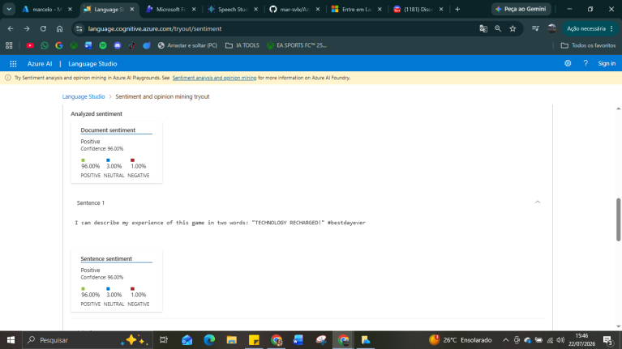
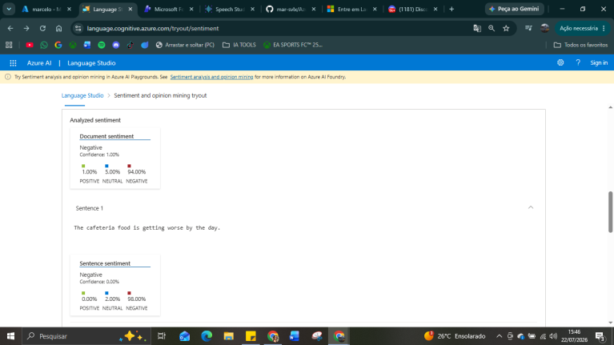
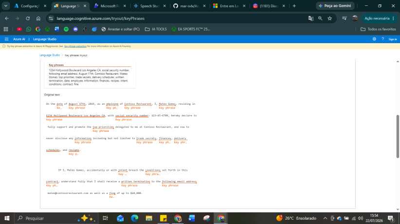

# Azure-speech-language-AI.
  Este repositório apresenta os estudos e experimentos realizados utilizando as ferramentas [Azure AI Language Studio](https://learn.microsoft.com/en-us/azure/ai-services/translator/document-translation/language-studio?tabs=local-env) e [Azure AI Speech Studio](https://learn.microsoft.com/en-us/azure/ai-services/speech-service/speech-studio-overview). Ao longo do laboratório foram executados testes práticos para compreender o funcionamento de seus principais recursos e refletir sobre suas possíveis aplicações.
  
## Análise de Sentimentos(Analyze Sentiment) - Language Studio.
  Para compreender a função de **analise de sentimentos**, foram realizados dois experimentos com resultado predominantemente **positivo** e outro **negativo**. O primeiro resultado obteve 96% positivo, 3% neutro e 1% negativo. O resultado foi baseado na frase "I can describe my experience of this game in two words: "TECHNOLOGY RECHARGED!" #bestdayever". Observa-se que a expressão "#besteverday" possui uma forte carga emocional positiva, influenciando diretamente a classificação do sentimento da análise. A baixa porcentagem atribuída aos sentimentos neutro e negativo demonstra que o algoritmo possui um alto grau de confiança quando encontra palavras e expressões claramente favoráveis.
  
  
  > Esse experimento demonstra que o modelo não considera apenas palavras isoladas, mas interpreta o contexto geral da frase para determinar o sentimento predominante.

  Agora analisando o teste de resultado negativo, a frase usada foi "The cafeteria food is getting worse by the day...". O resultado retornado é de 94% negativo, 5% neutro e 1% negativo. Faz bastante sentido quando analisamos a frase "getting worse by the day",indicando uma percepção de deterioração contínua da qualidade do serviço, oque reforça a interpretação negativa da frase.
  

  > Ferramentas desse tipo, podem e são ultilizadas para analisar e monitorar automaticamente avaliações de clientes sobre um estabelecimento ou produto, permitindo identificar tendências de satisfação ou insatisfação dos consumidores.

## Extração de palavras-chave (extract key phrases) - Language Studio.
  Diferente da Análise de Sentimentos ele não procura descobrir os sentimentos da frase, mas identificar automaticamente os principais conceitos presentes em um texto. Isso permite resumir grandes documentos, e extrair todas informações necessarias e mais relevantes.
  No teste efetuado ele pode extrair informações como: endereço, restaurane, empregado, contrato, cronogramas, informações financeiras, prazo etc. o interessante é que ele não tenta resumir, mas buscar descobrir quais são os conceitos importantes.
  
  
  > No contexto jurídico, essa funcionalidade pode auxiliar na identificação automática de cláusulas, obrigações, prazos e outras informações relevantes em contratos ou documentos extensos.

## Fala para texto(Speech to text) - Speech studio.

  Com esse recurso é possível converter automaticamente um conteúdo de áudio em texto. Durante o teste, a ferramenta identificou o idioma da gravação e realizou a transcrição da conversa de forma automática, preservando o conteúdo falado.
  O resultado demonstra que o serviço é capaz de transformar conteúdo falado em texto estruturado de forma rápida, possibilitando aplicações como transcrição de reuniões, entrevistas, aulas, audiências e atendimentos ao cliente.
  
## Texto para fala(Text to speech) - Speech studio.

  Durante o teste realizado, foi possível observar que a voz sintetizada apresentou boa fluidez, pronúncia natural e pausas compatíveis com a estrutura da frase. Esse resultado demonstra a evolução das vozes neurais em relação aos antigos sintetizadores de fala, proporcionando uma experiência mais natural e agradável ao usuário.

  > Essa funcionalidade possui aplicações práticas em assistentes virtuais, sistemas de acessibilidade, leitura automática de documentos, centrais de atendimento e criação de conteúdos em áudio.

### Reflexões finais.
  Os experimentos demonstraram que os serviços do Azure AI vão além da automação de tarefas, permitindo transformar textos e áudios em informações estruturadas que podem apoiar análises e processos de tomada de decisão. Recursos como análise de sentimentos e extração de palavras-chave mostram como a Inteligência Artificial pode auxiliar na interpretação de grandes volumes de informação de forma organizada e consistente.
  Embora os testes realizados sejam simples, eles evidenciam aplicações práticas em diferentes áreas, como atendimento ao cliente, acessibilidade, análise documental e apoio à tomada de decisões.
